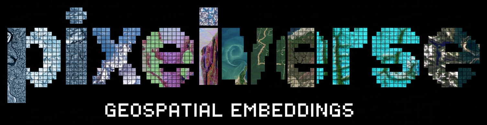

<p align="center">
    <br>
    
    <br>
<p>

Cloud native tooling to generate and store pixelwise geospatial foundation model embeddings.

We are working to **#FreeTheEmbeddings** and make geospatial embeddings available to all.

> [!WARNING]
>
> `pixelverse` is in development -- expect frequent releases and possible bugs or missing features

## Getting started

We use all the new hip tools like [uv](https://docs.astral.sh/uv/), [ty](https://docs.astral.sh/ty/), and [pre-commit](https://pre-commit.com/) to make this project easy to use.

```bash
curl -LsSf https://astral.sh/uv/install.sh | sh
uv sync --all-extras
uv run pre-commit install

# optionally run pre-commit hooks manually
uv run pre-commit run --all-files
```

### Pixelwise Geospatial Foundation Models

`pixelverse` provides access to a growing collection of pixelwise geospatial foundation models.
You can list available models with:

```bash
uv run python -c "import pixelverse as pv; print(pv.list_models())"
```

#### Supported Models

- [**Tessera**](https://arxiv.org/abs/2506.20380): Tessera is a pixelwise time-series geospatial foundation model. It takes as input a 14-channel time series of pixel values, `(10 S2 bands, 1 S2 DOY, 2 S1 bands, and 1 S1 DOY)` and outputs a `128`-dimensional embedding.

### Citing

If you use this software in your research, please cite:

```bibtex
@misc{pixelverse,
  title={Pixelverse: Pixelwise Geospatial Embeddings for All},
  author={Morrissey, Martha and Corley, Isaac},
  year={2025},
  publisher = {GitHub},
  journal = {GitHub repository},
  howpublished={\url{https://github.com/developmentseed/pixelverse}}
}
```
